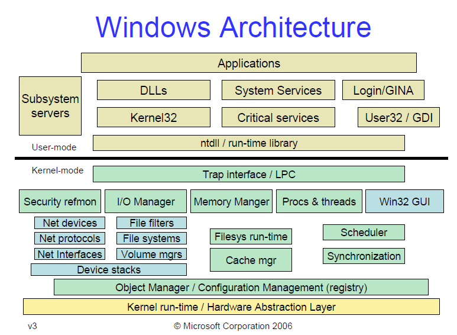

Tersine mühendislikte işlemcinin mimari yapısıyla birlikte işlemleri yürüteceğimiz işletim sisteminin de mimari yapısını bilmekte fayda vardır. Eğer işletim sisteminin mimari yapısı hakkında bilgi sahibi olursak veya hakim olursak, bu işletim sistemi için tasarlanan zararlı yazılımların mantığını anlamamıza yardımcı olmakla beraber inceleme aşamasına bizlere daha faydalı olacaktır.

  
!> Öncelikli olarak bu çalışmalar için yapacağımız tüm işlemler user-mode içerisinde olacaktır. Bu iki katmanla ilgili olarak :

**User-Mode (Kullanıcı Mod)**

Herhangi bir uygulama çalıştığı zaman, Windows tarafından her çalışan bir uygulama için işlem oluşturulur. Daha sonrasında bu işlemde çalışan uygulama için özel sanal adres (private virtual address) oluşturur. Bu oluşturulan özel adres alanları sadece bir uygulamaya ait olduğu içinde diğer uygulamalar tarafından değiştirilemez. Bu yüzden kullanıcı modunda çalışan bir uygulama crash olduğu zaman, sadece o uygulamayı etkiler. Ek bir bilgi olarakta bu mod içerisinde çalıştırılan uygulamalar için oluşturulan sanal adres alanları (virtual address space) limitli bir yapıya sahiptir. Çünkü buradaki amaç bütünlüğün dağılmasına önlem almak diyebiliriz.

**Kernel-Mode (Çekirdek Mod)**

user-mode’un aksine burada herşey ile ilgili olarak tam olarak erişim mevcuttur (CPU, Hafıza, sürücüler..). Yine user-mode’un aksine herhangi bir özel sanal alan mevcut değildir. Tüm kodlar, kernel-mod’da yer alan paylaşımlı tek bir sanal adres alanında çalışır. Eğer kernel-mode olarak çalışan bir uygulama crash olursa, tüm işletim sistemi de crash olabiliyor. Burada ek olarak normalde sürücüler, kernel mode içerisinde yürütülür. Fakat bazı sürücüler user-mode içerisinde de çalışıyor. Bu yüzden bu tarz sürücüler ‘user-mode drivers’ olarak adlandırılıyor.
