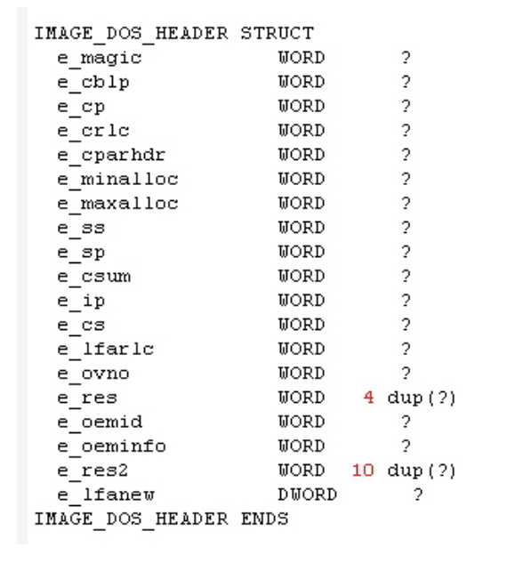
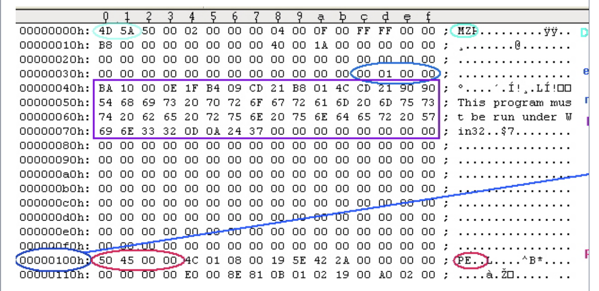

Tüm Portable Executable dosyalarında, her bir dosyanın ilk 64 byte’ını kapsayan bir DOS Header (üstbilgi) ile başlıyor. Programların DOS’tan çalıştırılması durumunda DOS, bunu bir yürütülebilir bir dosya olarak tanımlayabilir ve header’dan hemen sonra depolanan DOS stub’ı çalıştırabilir. DOS stub genellikle "This program must be run under Microsoft Windows" bir dize yazdırır ama tam bir DOS programı da olabilir.  
  
Windows için bir uygulama oluşturulduğu zaman Linker, WINSTUB.EXE adlı varsayılan stub programı, çalıştırılabilir (executable) dosyaya bağlar. Bunun yanında kendi oluşturduğunuz MS-DOS tabanlı programlarınızı WINSTUB yerine -STUB kullanıp, değiştirerek varsayılan Linker davranışını geçersiz kılabiliyorsunuz. (-STUB: yürütülebilir dosyayı bağlarken gelen Linker seçeneği)  
  
DOS Header windows.inc veya winnt.hv dosyalarında tanımlanan bir yapıdır. Ve bu yapının 19 üyesi vardır:

  
Bir PE dosyasında bulunan DOS Header’ın en anlamlı veya en sihirli kısmı, geçerli bir DOS Header’ı ifade eden 4Dh ve 5Ah ifadelerini içerir. (MS-DOS’un orjinal mimari yapısından biri olan MZ harfleri). Hex editor ile herhangi bir PE dosyası açıldığı zaman göreceğimiz 2 baytlık yapıya MZ denir.  
  
Yukarıdaki resimde görüleceği üzere Ifanew, DOS stub’ın başlamasından hemen önce DOS başlığının sonunda bulunan bir DWOR’dür. Dosya başlangıcına göre PE Header’ın offsetini içerir. Windows Loader’da bu offset’i arar böylece DOS stub’ı atlayabilir ve doğrudan PE başlığına gidebilir.

  
Daha önce belirttiğim gibi DOS Header dosyanın ilk 64 baytını kapsıyor. Yukarıdaki Hex editor’de görülen ilk 4 satır. DOS stub başlamadan önce en son DWORD 00h 01h 00h 00h içerir. Ters bayt sırasına izin verildiğinde bize 00 00 01 00h değerini verir. Bu da PE Header’ın başladığı ofsettir. PE Header 50h, 45h, 00h, 00h imzası ile başlar. 

PE Header’ın imza alanında bir PE yerine bir NE imzası bulunuyorsa eğer, yeni 16-bit Windows Executable dosya ile çalışıyorsunuz demektir. Aynı zamanda imza alanında bir LE bulunuyorsa Windows 3.x sanal aygıt sürücüsünü (VxD) gösterir.

