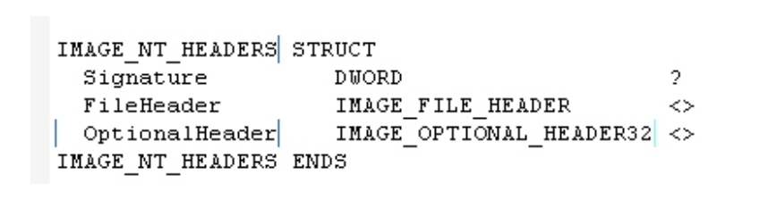
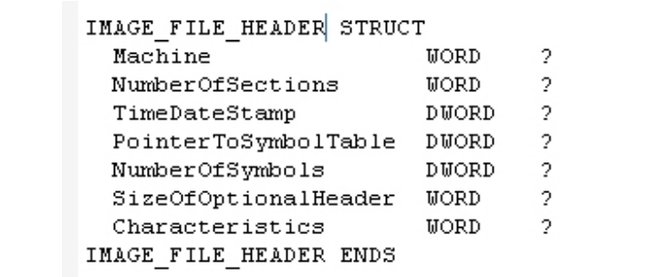
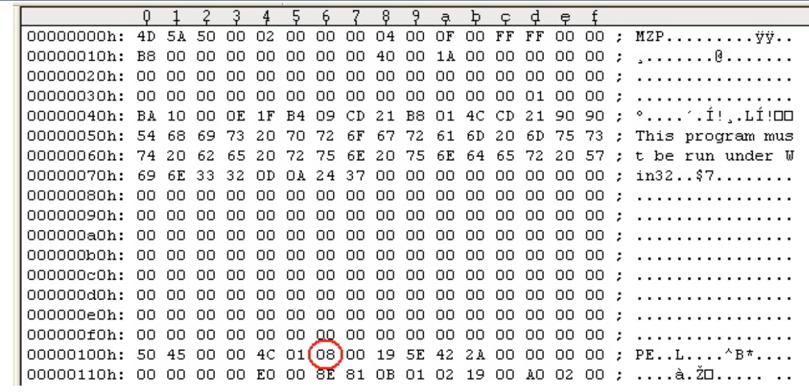
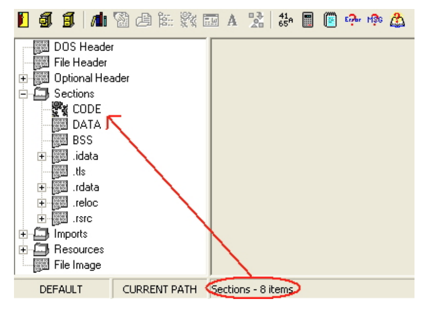
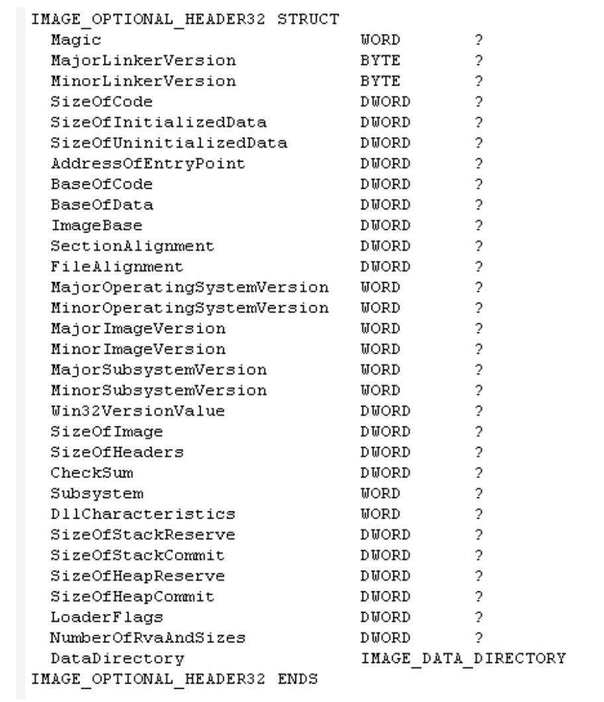
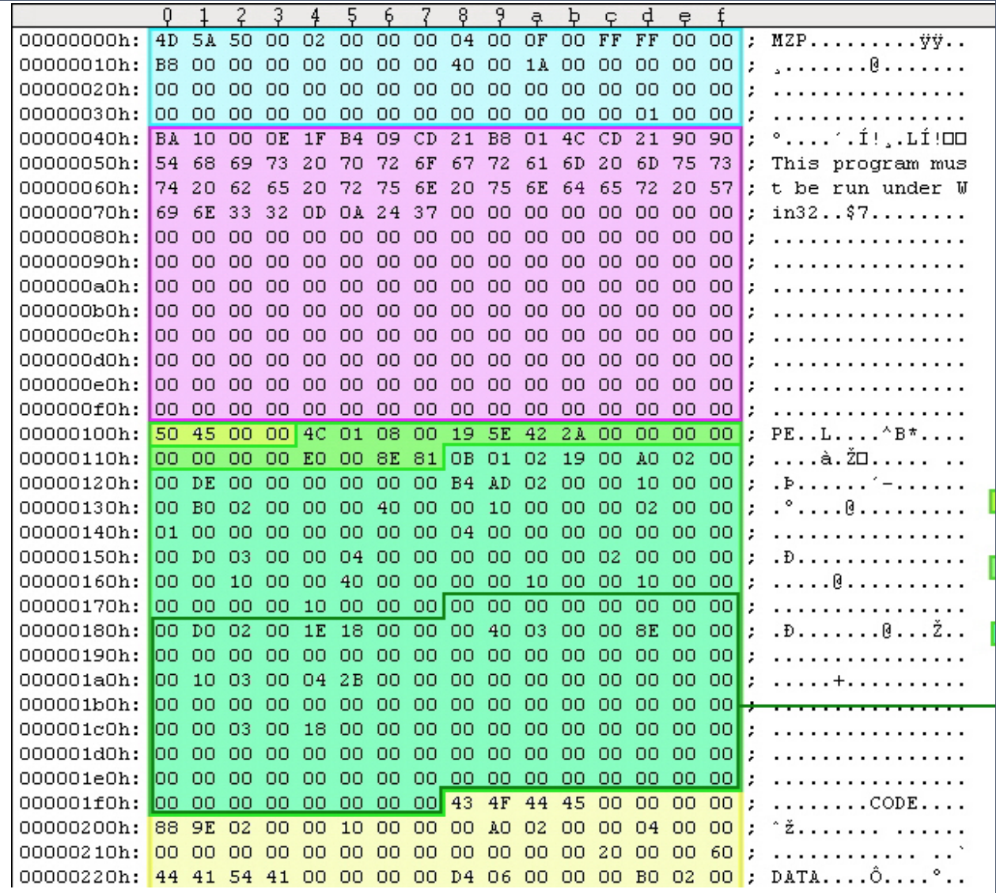

PE Header, IMAGE NT HEADERS olarak adlandırılan genel yapının bir terimidir. Bu yapı yükleyici (loader) tarafından kullanılan temel bilgileri içeriyor. IMAGE NT HEADERS üç üyeye sahiptir ve windows.inc içerisinde tanımlanmıştır.

  
Yukarıdaki resimde yer alan Signature 50h, 45h, 00h, 00h değerlerini içeren bir DWORD’dur. İkinci olarak yukarıda yer alan FileHeader, PE dosyasının sonraki 20 byte’ını oluşturur ve dosyanın fiziksel düzeni ve özellikleri hakkında bilgi içerir(örnek olarak numberofsections). Üçüncü olarak OptionalHeader, her zaman mevcuttur ve PE dosyasının sonraki 224. byte‘dır. Bu bölüm PE dosyasının mantıksal düzeni hakkında bilgi içerir (Örnek olarak AddressOfEntryPoint). Boyutu ise FileHeader’ın bir üyesi tarafından verilir. Bu üyelerin yapıları da windows.inc içerisinde tanımlanmıştır. FileHeader ise aşağıda yer alan resimdeki şekilde tanımlanmıştır.

  
Bu üyelerin biri hariç diğerleriyle ilgili pek bir değişiklik yapmamız gerekmiyor aslında. Sadece PE dosyasına bölümler eklersek veya PE dosyasından bölüm silersek eğer NumberOfSection‘ı değiştirmemiz gerekecektir. Örneğin bir PE dosyasının executable veya bir DLL olup olmadığı ile ilgili özellikleri içeren bazı flags‘lar içerir.

  
Yukarıdaki resimde yer alan HexEditor örneğine bakacak olursak eğer, PE Header’ın başlangıcından itibaren WORD ve DWORD’ları (6 bytes) sayarak NumberOfSection‘ı bulabiliriz.

  
Bunun haricinde bir başka yol ile de bunu doğrulayabiliriz. Buna örnek olarak yukarıdaki resimde yer alan PeBrowse aracını örnek olarak verebiliriz. Bunların haricinde ise LordPE veya PEID araçlarını da örnek olarak verebiliriz. Bu ve benzeri araçlar yardımıyla da bu işlemi gerçekleştirebiliriz. Açıkçası bunlar arasında son derece yararlı olan PEID aracını tavsiye edebilirim.

  
OptionalHeader‘a geçiş aşamasında 224 bytealır ve son 128 byte’ı veri dizinini içerir. Bununla ilgili tanım yukarıdaki resimde yer almaktadır. Bu tanımlamaların bazılarına bakacak olursak eğer;  
  
- AddressOfEntryPoint - PE yükleyici (loader) PE dosyasını çalıştırmaya hazır olduğunda, çalıştırılacak ilk komutun RVA’sıdır. Eğer yürütme akışını başlangıçtan itibaren yönlendirmek isterseniz, bu alandaki değeri yeni bir RVA ile değiştirmeniz gerekecektir. Ve bu oluşturulan RVA’daki komut ilk önce çalıştırılacaktır. Yürütülebilir (executable) paketleyiciler bu değeri genellikle kendi decompression stub’ı için yeniden yönlendirir. Ardından uygulamanın orjinal giriş noktasına (OEP) geri döner.  

- Imagebase - PE dosyası için tercih edilen yükleme adresidir. Örnek olarak vermek gerekirs; bu alandaki değer 400000h ise PE yükleyici, sanal adres alanına (virtual address space) yüklemeyi deneyip 400000h’dan başlatmayı deneyecektir. Başka bir modülün bu alanda hali hazırda olduğu durumlarda ise PE yükleyici bu dosyayı bu alana yükleyemeyecektir.  
  
- SectionAlignment - Hafızalara yükleme yapıldığı zaman bölümlerin hizalandığı bölümdür(bayt cinsinden). FileAligment’dan büyük veya eşit olmalıdır. Örnek vermek gerekirse; eğer bu alandaki değer 4096 (1000h) ise her bölüm 4096 byte’nın katlarında başlamalıdır. Eğer ilk bölüm 401000h ve boyutu 10 byte ise bir sonraki bölümün 402000h olması gerekiyor.  
  
- FileAlignment - Görüntü dosyasındaki bölümlerin ham verilerini (raw data) hizalamak için kullanılan hizalama faktörüdür (byte cinsinden). Örnek vermek gerekirse; bu alandaki değer 512 (200h) ise her bölüm 512 byte’ın katlarında başlamalıdır. İlk bölümün dosya ofseti 200h ve dosya boyutu 10 byte ise bir sonraki bölümde dosya ofseti 400h olarak yer almalıdır.  
  
- SizeOfImage - Bellekte PE görüntüsünün genel boyutunu temsil eder.  
  
- SizeOfHeader - Tüm başlıkların (headers) ve tüm bölüm tablosunun (section table) birleşik boyutunun ifade edildiği yerdir.  
  
!> [Geri kalan tüm değerlerle ilgili MSDN sayfalarından yararlanabilirsiniz](https://msdn.microsoft.com/en-us/library/windows/desktop/ms680547(v=vs.85).aspx)

PE Header’ın genel düzeni aşağıdaki resimde görülüyor.

  