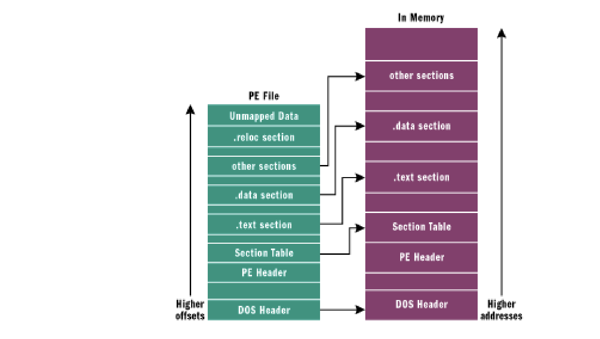

Portable Executable (PE) Windows’un çalıştırılabilir dosya formatıdır. 1993 yılında Windows tarafından tasarlanan bu format, TIS (tool interface standard) Komitesi (Microsoft, Intel, Borland, Watcom, IBM ve diğerleri) tarafından standartlandırılmıştır.  
  
Portable Executable .acm, .ax, .cpl gibi pek çok uzantının yanı sıra herkes tarafından çokca bilinen .DLL ve exe uzantılarını kapsamaktadır. Bir PE dosyasının en azından iki bölümü olacaktır. Bir Windows NT için olan bir uygulama .text, .bss, .rdata, .data, .rsrc, .edata, .idata, .pdata ve .debug adlı önceden tanımlanmış 9 bölüm içerir. Fakat bazı uygulamalar bu bölümlerin hepsine ihtiyaç duymaz.

Bir executable dosyada en yaygın olarak kullanılan bölümlere bakmak gerekirse:

- Executable Code Section (yürütülebilir kod bölümü) - .text (Microsoft) veya CODE(Borland) olarak adlandırılıyor.
- Veri bölümleri (Data Sections) - .data, .rdata, .bss (Microsoft) veya (Borland) olarak adlandırılıyor.
- Kaynaklar bölümü (Resources Section) - .rsrc olarak adlandırılıyor.
- Dışa aktarılan veri bölümü (Export Data Section) - .edata olarak adlandırılıyor.
- İçe aktarılan veri bölümü ( Import Data Section) - .idata olarak adlandırılıyor.
- Debug bilgi bölümü (Debug Information Section) - .debug olarak adlandırılıyor.

Yukarıda verilen isimlere baktığımızda birbirinden farklı ve ilgisiz olduğu görülüyor. Bu isimler OS tarafından göz ardı ediliyor ve sadece programcıların rahatlığı ve konforu için mevcuttur. Bir diğer nokta ise disk üzerinde yer alan PE dosyasının yapısı, belleğe yüklenildiği zaman ki ile aynıdır. Eğer disk üzerinde dosya bilgilerini bulabilirseniz, dosya belleğe yüklendikten sonra da bulabilirsiniz. Fakat tam olarak kopyalanamadığı belirtiliyor.

Windows’un kullandığı sayfa tabanlı sanal bellek yönetimi nedeniyle diskte yer alan dosyadaki bir öğenin yeri, genellikle belleğe yüklendikten sonra ilk yüklendiği yere göre farklılık gösterir. Belleğe yükleme gerçekleştikten sonra her bölüm yeni bir sayfadan başlar ve 4 kb bellek sayfalarına sığacak şekilde hizalanır. Yukarıdaki resimde sanal bellek çalışma biçimi vardır.  
  
Sanal bellek kavramı konseptini kısaca tanımlarsak eğer bir yazılımın fiziksel belleğe doğrudan erişimine izin vermek yerine, işlemci ve işletim sistemi arasındaki oluşturulan görünmez bir katmandır. Bellek erişimi için yapılan her denemede, işlemci fiziksel bellek adresinin gerçekte hangi şekilde kullanılacağını söyleyen bir Sayfa Tablosu (Page Table)’na başvurur. Her bir bellek bayt için bir tablo girişi olması pratik açıdan pek uygulanabilir olmayacağından işlemciler, belleği sayfalara ayırır. Bunun birkaç avantajına bakıldığında:

- Çoklu adres alanlarının oluşturulmasını sağlar. Bir adres alanı yalnızca geçerli bir program veya işlemle ilgili belleğe erişim izni veren yalıtılmış bir sayfa tablosudur. Programların birbirinden tamamen yalıtılmış olmasını sağlar böylece bir programının çökmesine neden olan bir hatanın başka bir programının adres alanını bozulmamasını sağlar.

- İşlemcinin belleğe nasıl erişildiğine dair belirli kuralları uygulanabilmesini sağlar. PE dosyalarında bölümler gereklidir çünkü bir modül yüklendiğinde dosyadaki farklı alanlar bellek yöneticisi tarafından farklı şekilde ele alınır. Yükleme zamanı olduğunda bellek yöneticisi farklı bölümler için bölüm başlıklarındaki ayarlamalara bağlı olarak bellek sayfalarındaki erişim haklarını ayarlar. Buda belirli bir bölümün okunabilir, yazılabilir veya yürütülebilir olup olmadığını belirler ve genellikle her bölümün yeni bir sayfada başlaması gerektiği anlamına gelir.

- Kullanılmadıkları sırada sayfaları fiziksel bellekten geçici olarak saklamak için sabit diskteki bir disk belleği dosyasının kullanılmasını sağlar. Örnek olarak vermek gerekirse bir uygulama yüklendiğinde eğer boşta kalırsa, RAM’a yüklenmesi gereken başka bir uygulamaya boş alan açmak için adres alanı diskte dağıtılabilir. Eğer tersi bir durum olursa, işletim sistemi ilk uygulamayı basitçe RAM’a yükleyebilir ve kaldığı yerden devam ettirebilir. Bir uygulama fiziksel olarak mevcut olandan daha fazla bellek kullanabilir çünkü sistem yeterli fiziksel bellek olmadığı zaman ikincil depolama yeri olarak sabit diski kullanabilir.

!> PE dosyaları windows loader tarafından belleğe yüklendiğinde, bellek içi sürüm bir modül olarak bilinir. Dosya eşleştirmesinin başladığı başlangıç adresi bir HMODULE olarak adlandırılır. Hafıza içerisindeki bir modül, işlem için gerekli olan yürütülebilir bir dosyada bütün kodu, veriyi ve kaynakları temsil eder.

