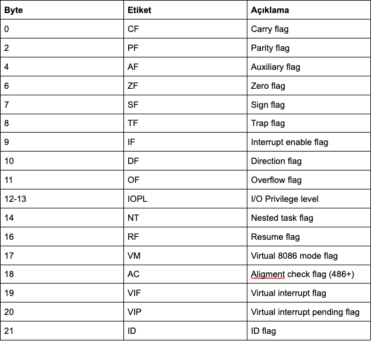

Giriş kısmında hatırlayacağınız gibi Assembly programlama için en düşük seviye programlama dili olduğunu ve bunun da onu tersine çevirmede çok yüksek derecede uygun kıldığından söz etmiştik. Bu kısımda ise C programlama dilinde yazdığımız  ‘Hello World’ kodu üzerinden komut setlerinden bahsedeceğiz. Buna geçmeden önce Intel 8086 ve 8088’den bahsetmek istiyorum. Bu şu anda yaygın bir biçimde x86 olarak adlandırılan komut kümesine sahip ilk CPU’lardır. Bunun yanında  Intel 32 bit mimarisi (`IA-32`) bazı yerlerde `i386` olarak adlandırılmaktadır. i386 ise x86 komut mimarisinin 32 bit sürümüdür. 

Açıkcası bu kısımda x86 komut setinin tamamından söz etme gibi bir durum söz konusu değil olmazda açıkcası. Çünkü Intel’in web sitesine gidip incelediyseniz eğer x86 komut setlerinin yer aldığı kılavuz dökümanın 3000’e yakın sayfadan meydana geldiğini göreceksinizdir. Bu yüzden bu kısımda x86 programlama için temel bir fikir edinmeye yetecek kadar bilgiler yer alacaktır.

# Registers

Aşağıdaki resimde göreceğiniz üzere modern x86 işlemcilerin genel amaçlı 8 adet `32-bit registers` vardır. Bu registers adları genel olarak geçmişe aittir. Örneğin `EAX`, bir dizi aritmetik işlem tarafından kullanıldığından akümülatör, `ECX` ise bir döngü indeksini tutmak için kullanıldığından sayaç olarak adlandırıldı. Registers’ların pek çoğu modern komut setinde özel amaçlarını kaybetmişken, geleneksel olarak `ESP` (yığın işaretçisi) ve `EBP` (temel işaretçi) özel amaçlar için ayrılmıştır. 

EAX, EBX, ECX, and EDX registers’lar için alt bölümler (subsections) kullanılır. Örnek olarak EAX’in en az önemli olan `2 byte`’ı `AX` adı verilen `16 byte`’lık bir kayıt olarak değerlendirilebilir. `AX`’in en önemsiz byte’ı `AL` adı verilen tek bir `8 byte`’lık register olarak kullanılabilirken, `AX`’in en önemli byte’ı ise `AH` adı verilen tek bir `8 byte`’lık register olarak kullanılabilir. Bu isimler aynı fiziksel sicile atıfta bulunur. `DX`’e iki byte’lık bir miktar yerleştirildiği zaman, olacak güncellemeler `DH`, `DL` ve `EDX`’in değerini etkiler. Bu alt yazmaçlar (`sub-registers`), esas olarak komut setinin `16 byte`’lık versiyonları olan daha eski versiyonlarından tutulanlardır. Bununla birlikte bazı zamanlar `32 byte`’dan küçük verilerle (örneğin 1-byte ASCII karakterleri) uğraşırken kullanışlıdırlar.

Madde ve kategorisel olarak registers’ları sıralarsak;

**1. Genel amaçlı kullanılan Registers**

`EAX` - Bir dizi aritmetik işlem tarafından kullanıldığından akümülatör register’ı olarak adlandırılır.

`EBX` - Base register olarak adlandırılır ve taban adreslerini tutar

`ECX` - Bir döngü indeksini tutmak için kullanıldığından, sayaç (counter) register’ı olarak adlandırılır.

`EDX` - Data register’ı olarak adlandırılır.  

`ESI` - Kaynak dizin register olarak adlandırılır. Dizi ve bellek kopyalama için kullanılır.

`EDI` - Hedef dizin register olarak adlandırılır. Dizi, bellek dizisi koyalama, ayarlama ve ES ile uzak işaretçi adresleme için kullanılır.

`ESP` - Yığın işaretçisi register olarak adlandırılır. Yığının en üst adresini tutar.

`EBP` - Yığın taban işaretçisi register olarak adlandırılır. Yığının temel adresini tutar.

**2. Segment Registers**

`CS` -  Programınızın içinde çalıştığı kod segmentini tutar. Değerinin değiştirilmesi bilgisayarın kilitlenmesine sebep olabilir.

`DS` - Programınızın eriştiği veri segmentini tutar. Değerini değiştirilmesi yanlış veriler vermesine sebep olabilir.

`ES, FS, GS` -  Bunlar video belleği vb. Gibi uzak işaretçi adresleme için kullanılan ekstra segment kayıtlarıdır.

`SS` - Programınızın kullandığı yığın (stack) segmentini turar. Bazı zamanlar DS ile aynı değere sahiptir. Değerinin değiştirilmesi çoğunlukla verilerde olmak üzere öngörülemeyen sonuçlar verebilir.

**3. EFLAGS Registers**

