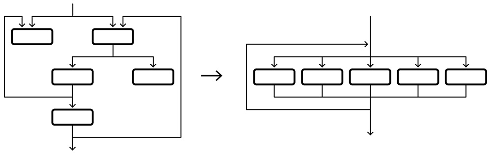

Obfuscation (gizleme) için yazılım bağlamında bir tanım yapılacak olursa; ikili ve metinsel terimleri okunamaz hale getiren ve/veya anlaşılması zor bir hale getiren tekniktir. Bu teknik, yazılımı geliştiren kişler tarafından, geliştirdikleri yazılımları tersine mühendislik veya korsanlık yapılmasını istemedikleri için kullanılmaktadır.

Uygulanma tarafına bakıldığı zaman birkaç bitlik manipülasyon kadar basit olabileceği gibi, kriptografik standartlar (AES, DES vb.) kadar de gelişmiş olabiliyor. Zararlı yazılımlar tarafından bakıldığı zaman, yazılımın kullandığı önemli dizeleri (strings gini) gizlemek onlar açısından yararlı olabiliyor. Çünkü inceleme aşamasında ilgili zararlı yazılımın davranışına ilişkin fikir verebilir. Bu dizelere örnek vermek gerekirse zararlı yazılımın kodları içerisindeki tanımlanmış url'ler veya registry keys olabilir. 

# Kaynak Kod Gizleme (Obfuscation) Teknikleri 

- **Veri Dönüşümü** : kaynak kod gizlemenin en önemli unsurlarından biri, geliştirilmiş olan program tarafından işlenen verileri başka bir forma dönüştürmektir. Yapılan bu dönüştürme yazılmış olan kodun performans tarafında az bir etkiye sahip olmakla birlikte korsanların bu kodları parçalamasını veya tersine mühendislik tekniklerini uygulamasını zorlaştırır.

- **Kod akışını değiştirme** : Bu yöntem ile yazılmış olan kodun, kontrol akışı değiştirilerek, kdoun yönünün değiştirilmesi gerçekleştirilir. Bu yöntemle birlikte nihai sonuçların aynı olmasına rağmen, kodun neden belirli bir yön aldığının veya nereye gittiğinin anlaşılması işlemi çok daha uzun sürer. 

Örnek olarak yukarıdaki grafiği verebiliriz.

- **Adres Gizleme** : Bazı kaynak kod gizleme araçları tarafından kullanılan bu teknik, öngörülemezlik oluşturmak ve yararlanmayı çok daha zor hale getirmek için program verilerinin ve kodunun adreslerini değiştirir. Bir uygulama oluşturulduğu zaman, bu gizleme (Obfuscation) algoritması hafızadaki bazı kodların ve verilerin mutlak konumlarını ve farklı öğeler arasındaki göreceleri mesafeleri rastgele hale getirir. Bununla birlikte yapılan saldırılardaki başarı şansı azaltılır, aynı zamanda saldırgan eğer bir uygulama veya cihazda başarılı olsa dahi kopyalamada ve tersine mühendislik işlemlerinde faydasını azaltacaktır.

- **Gizlenmiş kodların devamlı olarak değiştirilmesi** : Bu teknik ile bir yazılım, gizlenmiş olarak güncelleştirme işlemlerini düzenli olarak sağlamasıyla birlikte saldırganların, ilgili kırma işlemleri için ellerindeki mevcut sürümden ziyade güncel sürümü edinmeye mecbur kılar. 

- **Assembly Kod talimatlarının değiştirilmesi** : Assembly kodunu dönüştürmek ve gizlemek, tersine mühendislik yapmayı daha zor bir hale getirebilir. Böyle bir yöntemle kodu, diğer bir kod içersinde gizleyerek bir çözücünün yanlış çıktı üretmesine neden olan üst üste binen (overlapping) assembly talimatlarını kullanmak olacaktır. Assembly kodu, gerekesiz kontrol ifadelerinin ve çöp kodunun dahil edilmesiyle birlikte penetrasyona (penetration) karşı da güçlendirilebilir.

- **Debug (Hata ayıklama) Bilgilerini Gizleme** : Kaynak kod gizleme araçları bu tekniği kullanarak, debug verilerindeki satır numaralarını ve dosya adlarını değiştirerek veya debug bilgilerini tamamen kaldırarak gerçekleştirir.