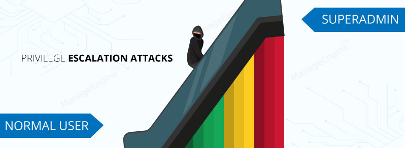

Bir saldırı için dayanak oluşturulduktan sonra saldırganlar, ağ üzerinde yayılmanın yollarına araştırırlar. Her ne kadar ilk erişimlerin bir bilgisayara karşı gerçekleştirilmiş olması, düzenlenen saldırının ilk aşamasını oluşturacaktır. Daha sonrasında ağ içerisinde değerli bilgileri depolayan sistemlere erişip, hedef altyapısında ilerleyebilmek için buradaki ayrılacıklarını arttırmaya  çalışacaklardır.

Ayrıcalık arttırmanın ([Privilege Escalation](https://attack.mitre.org/tactics/TA0004/)) en bilinen yöntemlerinin başında, bir bilgisayarın yapılandırma sorunlarından yararlanmaktır. Örnek vermek gerekirse yönetici kimlik bilgileri (administrator credentials), yanlış yapılandrılmış hizmetler, kullanıcıya verilen aşırı izinler, kasıtlı olarak zayıflatılmış güvenlik önlemleri vs denilebilir. Açıkcası bu tarz çok bilinen yöntemlerin, güvenlik araçları tarafından rahatça görülüp, tespit edilmesi daha kolaydır.

Saldirganlar bu tarz kolay tespit edilebilecek yöntemlerden ziyade, başka bir ifadeyle saldırganları başarıya götürecek yöntem olarak çekirdeğe (kernel) saldırı yapmak örnek verilebilir. Çekirdek tarafında herhangi bir erişime sahip olması durumunda saldırgan, tüm güvenlik kısıtlamalarını atlatmasına olanak tanıyacak daha yüksek bir bütünlük bağlamında rastgele kod çalıştırılmasına sebep olacaktır. Tabi ki bu ve benzeri durumlarda saldırganın ayrıcalıklarını arttırmasının ise sıfırıncı gün açıklarına (0-day) sahip olup-olmamamsıda etkili olacaktır. Ve günümüzde sıfırıncı gün açıkları çok büyük önem arz etmektedir.

!> **0-day** : Bir yazılımda daha önce bilinmeyen veya tespit edilmeyen konuyla ilgili kusurları ve saldırı gerçekleşene kadar tespit edilmesi zor olan zafiyetleri temsil eder.

Bazı ayrıcalık arttırma saldırı yöntemleri;

- Process Injection	

- Hijack Execution Flow	

- Access Token Manipulation	

- Create or Modify System Process

- Boot or Logon Autostart Execution	

- Event Triggered Execution	

- Scheduled Task/Job	