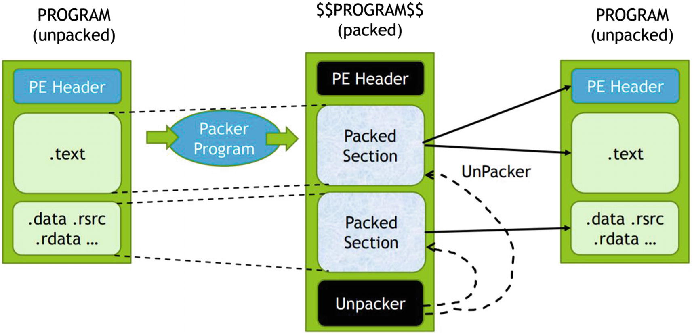

Kötü amaçlı yazılımlar incelendiği zaman birçok farklı tekniğin tek başına veya birlikte kullanıldığını görebiliriz. Özellikle bu teknikleri görebilme ve anlayabilme adına internette çok güzel bir kaynak olan [Mitre Att&ck](https://attack.mitre.org/wiki/Main_Page)'dan yararlanabiliyoruz. Böyle bir bilgi kümesinin çıkma amacı; saldırganların davranışlarını sistematik olarak belirleyip, kategorize etme 
ihtiyacından doğmuştur diye tanımlayabiliriz.

**Paketleyiciler (Packers)**

Zararlı yazılımları, incelemeye başlamadan önce bir bilgi toplama safhası gerçekleştirilir. Bu aşamalardan biri de ilgili zararlı yazılım packers kullanıp/kullanmadığını denetlemek olacaktır. Zararlı yazılımları yazan kişiler, yazdıkları kodların tespit ve analizlerden kaçınmalarını sağlamak için kullandıkları yöntemlerden biri de budur yani packers kullanmaktır. Paketleyiciler kullanılarak ilgili zararlı yazılım dosyasının biçimi sıkılaştırma yapılır ki bu da dosyanın daha küçük bir boyuta düşmesine yardımcı olacaktır. Şunu da belirtmek gerekir ki bu paketleyiciler sadece kötü amaçlı olarak kullanılmaz. Örnek vermek gerekirse oluşturmuş olduğunuz bir ürünün kodlarını kırılmaya veya kopyalamaya karşı gibi legal amaçlar için de kullanılır.

|                                              Paketleyiciler Listesi                                             |                                                                                                   |
|:---------------------------------------------------------------------------------------------------------------:|---------------------------------------------------------------------------------------------------|
| [Themida](http://www.oreans.com/themida.php)                                                                    | [Armadillo](http://www.siliconrealms.com/armadillo.php)                                           |
| [ASPack](http://www.aspack.com/aspack.html)                                                                     | [ASPR (ASProtect)](http://www.aspack.com/asprotect32.html)                                        |
| [BoxedApp Packer](http://www.boxedapp.com/boxedapppacker)                                                       | [CExe](http://www.scottlu.com/Content/CExe.html)                                                  |
| [dotBundle](http://www.dotbundle.com/)                                                                          | [Enigma Protector](http://www.enigmaprotector.com/)                                               |
| [EXE Bundle](http://www.webtoolmaster.com/exebundle.htm)                                                        | [EXE Stealth](http://www.webtoolmaster.com/exestealth.htm)                                        |
| [eXPressor](http://www.cgsoftlabs.ro/express.html)                                                              | [FSG](http://xtreeme.prv.pl/)                                                                     |
| [kkrunchy](http://www.farbrausch.de/~fg/kkrunchy/)                                                              | [MEW](https://web.archive.org/web/20070831063728/http://northfox.uw.hu/index.php?lang=eng&id=dev) |
| [MPRESS](http://www.matcode.com/mpress.htm)                                                                     | [Obsidium](http://www.obsidium.de/)                                                               |
| [PESpin](http://pespin.w.interia.pl/)                                                                           | [Petite](http://www.un4seen.com/petite)                                                           |
| [RLPack Basic](http://www.softpedia.com/get/Programming/Packers-Crypters-Protectors/RLPack-Basic-Edition.shtml) | [Smart Packer Pro](http://www.smartpacker.nl/)                                                    |
| [Themida](http://www.oreans.com/themida.php)                                                                    | [UPX](https://upx.github.io/)                                                                     |
| [VMProtect](http://vmpsoft.com/products/vmprotect)                                                              | [XComp/XPack](http://soft-lab.de/JoKo)                                                            |

