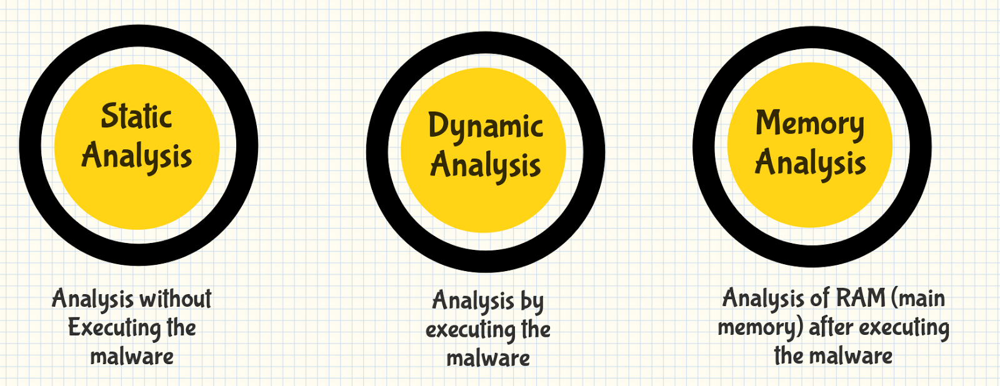

Zararlı yazılım terminolojisi altındaki yazılarda özellikle terminolojiler hakkında bilgi sahibi olmayı amaçlamıştık. Analiz kısımlarına geçmeden önce bu alandaki üç temel analiz tekniklerine bakacağız. Zararlı yazılımlar üç temel analiz tekniği üzerinde incelenmektedir:

- Statik Analiz

- Dinamik Analiz

- Hybrid Analiz

- Bellek analizi

# Statik Analiz Yöntemi

Temel statik analiz yönteminde, ilgili zararlı yazılıma ait kodların gerçekten çalıştırılmasına gerek duyulmamaktadır. Bunun yerine ilgili dosyayı kötü niyetli belirtilerin olma ihtimaline karşı incelemektedir. Özellikle burada hangi paketleme (packers) yönteminin kullanıldığı, hangi Obfuscation (kod karmaşıklaştırma) yönteminin kullanıldığı, hangi programlama diliyle yazıldığı, hangi kütüphanelerin kullanıldığı gibi zararlı yazılıma ait ön bilgileri toplamamıza yardımcı olacaktır. 

Ön bilgilerle birlikte dosya isimleri, hashes, diziler (IP adresleri, domain adresi, dosya başlığı verileri gibi) gibi bilgileri de elde edip, incelediğimiz dosyaların kötü amaçlı olup-olmadığını kontrol edebiliriz. Tabi ki bu kısımda bir dosyanın kötü amaçlı olup-olmadığına karar veremiyoruz ve elimizdeki dosyanın tam olarak amacını öğrenemiyoruz. Bu aşamada ise devreye dinamik analiz yöntemleri devreye giriyor.

# Dinamik Analiz Yöntemi

Öncelikli olarak dinamik analizleri, korumalı alan veya sanal alan diye tabir edilen Sandbox altında yürütülmektedir. Bunlar özellikle zararlı yazılım analizlerini hem statik hem de dinamik tarafta otomatize hale getirmektedir. Böylece incelenen dosyaların zararlı olması halinde, kendi ağınıza veya şirket ağınıza bulaşma riski olmadan incelemenize olanak sağlayacaktır. Fakat zararlı yazılım geliştiricileri, hem bilinen hem de bilinmeyen (henüz) anti analiz ve atlatma teknikleri kullanarak bu analiz ortamlarından kaçınmaya özen göstermektedirler. Dinamik analiz, tehdit avcılarına (threat hunters) ve SOC ekiplerine daha bir derin görünürlük sağlayarak, bir tehtidin gerçek doğasını ortaya çıkarmalarına olanak sağlayacaktır. 

Her ne kadar zararlı yazılımların analizleri Sandbox'lar sayesinde otomatize hale gelmiş olsada, bu sandbox yazılımları da anti analiz teknikleriyle etkisiz hale getirilmektedir. Çünkü bu yazılımların işletim sistemi içerisinde çalıştırdığı çeşitli araçlar için zararlı yazılım geliştiricileri, yazdıkları kodlar içerisinde tespit etme parametreleri yerleştirmektedirler. Bu da bizi ilgili zararlıyı manuel olarak incelemeye yöneltecektir.

# Hibrid Analiz Yöntemi

Statik ve dinamik analizin birleşmesiyle ortaya çıkmış bir yöntemdir. Bu yöntemde davranışsal analiz ile oluşturulan verilere statik analiz uygulanmaktadır. Örnek olarak kötü amaçlı yazılıma ait kod parçası çalıştırılıp, bellek tarafında bazı değişiklikler oluşturulduğu zamana dinamik analiz, bunu algılar ve analistler geriye dönüp bu bellek dökümü üzerinde temel statik analizleri gerçekleştirebilir.

# Bellek Analiz Yöntemi

Daha çok adli vakalardan aşina olduğumuz bir yöntemdir. Zararlı yazılımın bulaştığı makinenin o anki RAM imajının alınmasıyla çeşitli araçlar vasıtasıyla inceleme yapılabiliyor. Bunun yanında bu yöntemi zararlı yazılım analiz tarafıyla birikte şletim sisteminde veya kullanılan herhangi bir yazılımın Dump çıktısı alınarakta bu yöntemden faydalanabiliyor. Çünkü Windows tarafında zararlı yazılımlar legal bir dosyayı taklit ederek, legal görünüm altında illegal olarak çalışabilmektedirler.
