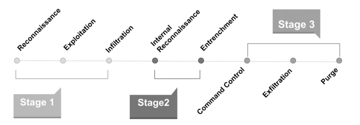

Başlangıçta, zararlı yazılım analizleri yapabilme adına tersine mühendislik temelinden söz edeceğimi belirtmiştim. Bu kısımda ise zararlı yazılım analizlerinden önce terminoloji hakkında da bilgi sahibi olmanın yararı olacaktır. 

# Zararlı Yazılım Nedir?

Zararlı yazılım, programlanabilir herhangi bir aygıta, hizmete veya ağa zarar vermek veya bunlardan yararlanmak üzere tasarlanmış her türlü zararlı yazılım için kullanılan kapsamlı bir terimdir. Siber suçlular genellikle bunu, mali kazanç için kurbanlardan veri elde ederek baskı yapmak üzere kullanır. Bu veriler finansal verilerden sağlık kayıtlarına, e-postalara ve parolalara kadar değişebilir. Kötüye kullanılabilecek bilgi türü sonsuzdur. (McAfee tanımı)

# Zararlı Yazılım Türleri nelerdir?

|      Zararlı Yazılım Türleri      |                                                                        Açıklama                                                                        |
|:---------------------------------:|:------------------------------------------------------------------------------------------------------------------------------------------------------:|
| Virus                             | Kullanıcı müdahelesiyle sistemler arasında yayılırlar.                                                                                                 |
| Worm (Solucanlar)                 | Kullanıcı müdahelesi gerektirmeden, sistemler arasında kendi başına yayılır veya çoğalırlar.                                                           |
| Ransomware (fidye yazılımları)    | Bulaştığı sistemlerdeki (Bir şirketin veya kullanıcının) verileri şifreleme veya diğer yollarla rehin tutan kötü amaçlı yazılımlardır.                 |
| Rootkit                           | Bulaştığı sistemlerde kendi varlığını veya başka bir yazılımın varlığını maskeler.                                                                     |
| Trojan                            | Bulaştığı sistemlerde legal bir yazılımın kılığına girerek yayılırlar.                                                                                 |
| Spyware                           | Bulaştığı sistemlerdeki kullanıcıya ait pek çok veriyi, başka birisine veya birilerine ileten bir kötü amaçlı yazılımdır.                              |
| Backdoor                          | Güvenliği ihmal edilmiş bir sisteme, uzaktaki saldırgan tarafından erişmeye ve ona komutlar göndermesini sağlar.                                       |
| RAT (Remote Administration Tools) | Temelde ağ ve sistem yöneticilerinin işlerini kolaylaştırma adına ortaya çıksa da, kötü amaçlı olarak da kullanılır.                                   |
| Adware                            | Bulaştığı sistemlerde kullanıcının isteğine bırakılmadan, otomatik reklamlar oluşturur. Bu sayede yazarına gelir elde etme amacı taşır.                |
| Bot                               | Bulaştığı sistemlerde diğer ağ hizmetleriyle etkileşime giren otomatik bir süreçtir.                                                                   |
| Keylogger                         | kullanıcının izni ve bilgisi olmadan klavye üzerinde tuşlanan karakterlerin bir dosyaya kaydedilip, başka bir yere gönderimini sağlayan yazılımlardır. |

