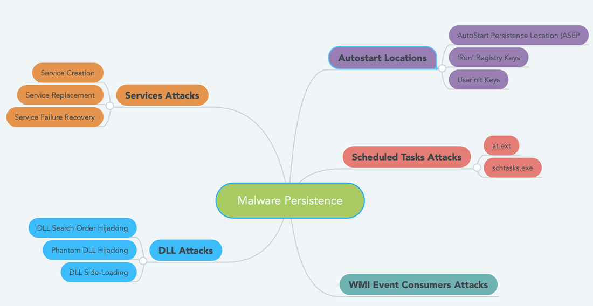

Saldırganlar, herhangi bir yöntemle erişebildikleri sistemleri kontrolleri altına alabilmek için, eriştikleri sistem veya sistemlere daha önce yüklemeyi başardıkları arka kapıların (`backdoors`) sistem başlatıldığı zaman, kurulu ve çalışır durumda kalmalarını sağlaması için persistance kullanırlar. Buralarda kullanılan veya kullanılacak `persistence tekniklerinin` basitliği veya karmaşıklığı genellikle erişim sağladıkları sistemle parelellik gösterir. Yani erişim seviyesi ne kadar yüksekse, burada kullanılan persistence tekniği o kadar karmaşık olacaktır.

Aslında çoğu zaman bakıldığında persistance, uzaktan erişim sağlanan sistemin her yeniden başlatıldığında aynı durumun kalıcılığının yani uzaktan erişim olanağının devam etmesini sağlayan yapılandırma değişikliklerinin bir sonucudur. Böyle bir durumda saldırganlar erişim sağladıklarını hedef bilgisayarların dosya sistemini, kayıt defterlerini, başlangıç klasörü (`startup folder`) vs değiştirirler. Her ne kadar erişilen sistemlerin yapısında değişiklikler yapılan tekniklerin yanısıra erişilen sistemlerin yapılarını değiştirmeyen tekniklerde mevcuttur ve tespit edilmesi diğerlerine nazaran daha zordur. Bu tarz bir tekniğe örnek verilmek gerekirse; Windows işletim sistemi içerisindeki `Domain Controller` yapısının tehlikeye atılması verilebilir. Bu gibi bir durumda saldırgan, `Windows Domain Controller` tarafındaki tüm envanteri kontrol edebilir ve böylece özel olarak seçilen veya tüm sistemde, uzaktan vereceği bir komutla zararlıyı çalıştırabilir. Çalıştırıldıktan sonra kötü amaçlı yazılım, tamamen `bellek` içerisinde çalışır ve kaynağını tesit etmek daha fazla zorlaşır.



# Persistence (kalıcılık) Teknikleri

Özellikle ilgili zararlı yazılımların analiz ortamında çalıştırılıp, `davranışsal analizi` kontrol edildiği zaman, burada en temel persistence yaklaşımlarından birinin başlangıç klasörlerinin (`startup folders`) kullanıldığı görülecektir. Bu klasörler başlama sırasında, işletim sistemi tarafından aranırlar ve bu konumlarda bulunan dosyalar çalıştırılır. Windows işletim sistemi kullanıcı (`user`) ve sistem (`system`) çapında olmak üzere `iki` tür başlangıç klasörü tutar. Kullanıcının başlangıç (`startup`) klasöründe bulunan dosyalar yalnızca o kullanıcı için yürütülürken, sistem genelindeki başlangıç klasöründe bulunan dosyalar sistem içerisinde oturum açmış her bir kullanıcı için geçerli olmaktadır.

Kullanıcının başlangıç PATH'ı :
```
C:\Users\<username>\AppData\Roaming\Microsoft\Windows\Start Menu\Programs\Startup\
```
Sistemin başlangıç PATH'ı :
```
C:\ProgramData\Microsoft\Windows\Start Menu\Programs\Startup
```
İkinci olarak kullanılan diğer bir yaygın teknikte, belirli konumlar altında registery keys oluşturarak yeniden üretilebilmesidir. Yine zararlı yazılım analiz ortamında, davranışsal analizleri incelediğimiz zaman bu ikinci temel yaklaşımı görebiliyoruz. Bir önceki örnekte olduğu gibi bu örnekte de kullanıcı (user) ve sistem (system) çapında iki farklı registry yeri vardır. Aşağıdaki örneklerde en yaygın olarak kullanılan konumlar belirtilmiştir.

Kullanıcının Registry yeri (`HKEY_CURRENT_USER` (HKCU)) :
```
HKEY_CURRENT_USER\Software\Microsoft\Windows\CurrentVersion\Run
HKEY_CURRENT_USER\Software\Microsoft\Windows\CurrentVersion\RunOnce
HKEY_CURRENT_USER\Software\Microsoft\Windows\CurrentVersion\RunServices
HKEY_CURRENT_USER\Software\Microsoft\Windows\CurrentVersion\RunServicesOnce
```
Sistemin registry yeri (`HKEY_LOCAL_MACHINE`(HKLM)):
```
HKEY_LOCAL_MACHINE\Software\Microsoft\Windows\CurrentVersion\Run
HKEY_LOCAL_MACHINE\Software\Microsoft\Windows\CurrentVersion\RunOnce
HKEY_LOCAL_MACHINE\Software\Microsoft\Windows\CurrentVersion\RunServices
HKEY_LOCAL_MACHINE\Software\Microsoft\Windows\CurrentVersion\RunServicesOnce
```
Yukarıdakilerle birlikte bir saldırgan, Windows Registry içerisindeki (`run keys` olarak bilinir) belirtli konumlara bir giriş ekleyerek, sistem her açıldığında veya kullanıcı oturum açtığı zaman ilgili zararlı kodu çalıştırabilir. Daha önce belirttiğimiz gibi yine burada da iki farklı konumu bulunmaktadır.

Kullanıcı konumunda:
```
REG ADD HKEY_CURRENT_USER\Software\Microsoft\Windows\CurrentVersion\Run /v <name> /t REG_SZ /d <filepath>
```
Sistem konumunda:
```
REG ADD HKEY_LOCAL_MACHINE\Software\Microsoft\Windows\CurrentVersion\Run /v <name> /t REG_SZ /d <filepath>
```
#  Gerçek Örnek - APT28/Hospital.doc

Öncelikli olarak `APT28`'den bahsetmek istiyorum. Bu grubun Rusya kökenli olduğu düşünülüyor özellikle yaptıkları eylem ve hareketlerden dolayı. Hatta Rusya'nın `GTsSS` askeri birimi `26165`'e affedilen bir tehdit grubu olduğu düşünülmektedir. Grubun 2004'den bu yana aktif olduğu biliniyor fakat daha öncesinde aktif olup-olmadıkları konusunda bir bilgi yer almıyor. Grubun kullandığı tüm tekniklere ait tüm detaylara  [Mitre Att&ck](https://attack.mitre.org/groups/G0007/) web sitesinden ulaşılabiliyor.

Geçmiş bir zamanda APT28 grubuna ait olan `Hospital.doc` adlı bir zararlı yazılım analizini gerçekleştirmiştim. Aşağıda zararlı yazılımın çalıştırıldıktan sonra kayıt defteri ve dosya sistemi konumuyla ilgili veriler yer alıyor;

Kullanıcı ve sistem tarafındaki kayıt yerlerinden bazılarını görüyoruz;
```
HKEY_CURRENT_USER\Software\Microsoft\Office\14.0\Word\Resiliency\StartupItems
HKEY_CURRENT_USER\Software\Microsoft\Office\14.0\Common\LanguageResources\EnabledLanguages
HKEY_CURRENT_USER\Software\Microsoft\Office\14.0\Word
HKEY_CURRENT_USER\Software\Microsoft\Windows\CurrentVersion\Internet Settings\ZoneMap
HKEY_LOCAL_MACHINE\SOFTWARE\Microsoft\Windows\CurrentVersion\Installer\UserData\S-1-5-18\Products\00004109D30000000000000000F01FEC\Usage
```
Yine kullanıcı ve sistem tarafındaki dosya sistemi konumundan bazılarını görüyoruz;
```
C:\Users\admin\AppData\Roaming\Microsoft\Templates\~$Normal.dotm
C:\Users\admin\AppData\Local\Temp\~$T28Hospital.doc
C:\Users\admin\AppData\Roaming\user.dat
```
